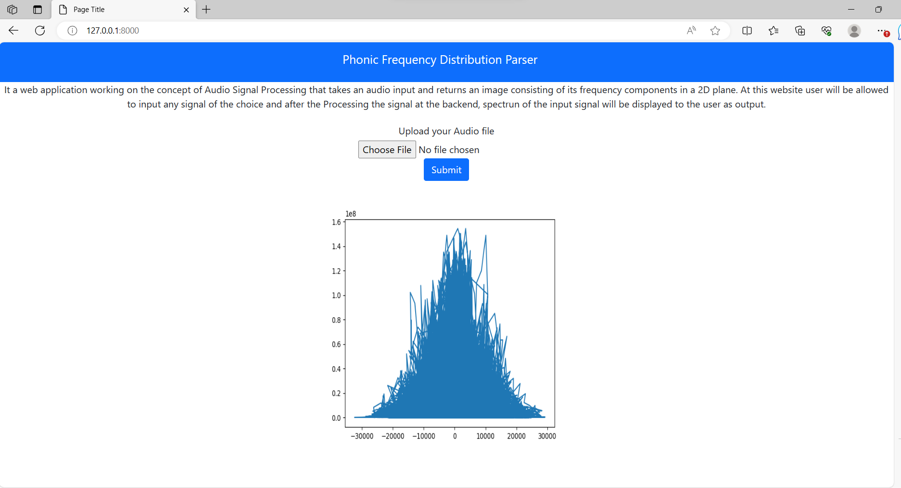

# Phonic_Frequency_Distribution_parser
  Developed a web application working on the concept of Audio Signal Processing that takes an audio
  input and returns an image consisting of its frequency components in a 2D plane.
1. First step is to install latest Python 3 version
2. Clone the repository in a folder using command
   git clone https://github.com/Pankaj98kumar/Phonic_Frequency_Distribution_parser.git
3. Install the other required systems by running requirments.txt file using command
   pip install -r requirements.txt
4. Make migrations using command
   python manage.py makemigrations
   python manage.py migrate
5. Runserver using command
   python manage.py runserver
# One will get the GUI to take input and for Output
  
  
  

   

